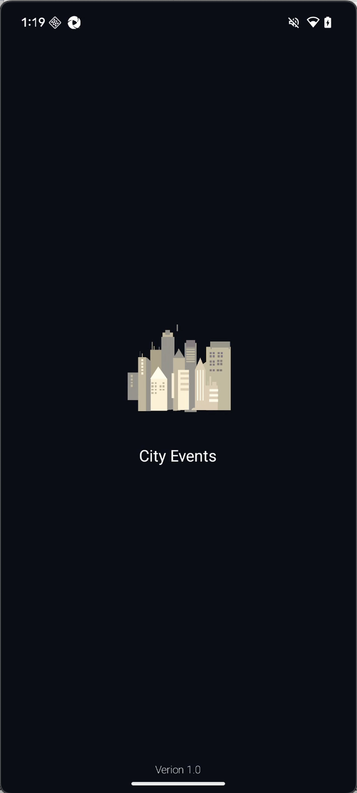
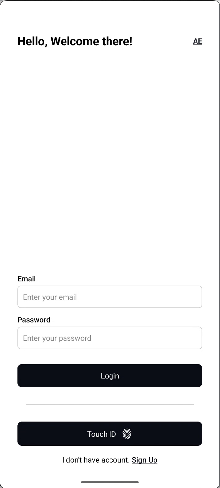
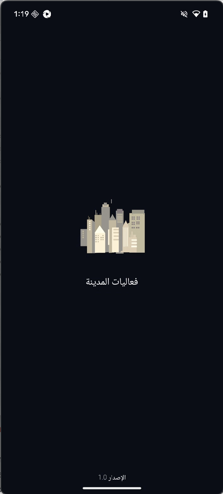
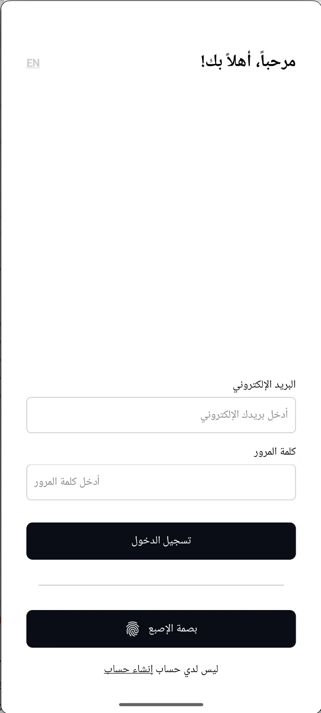
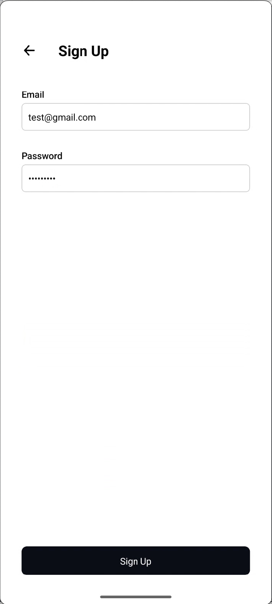
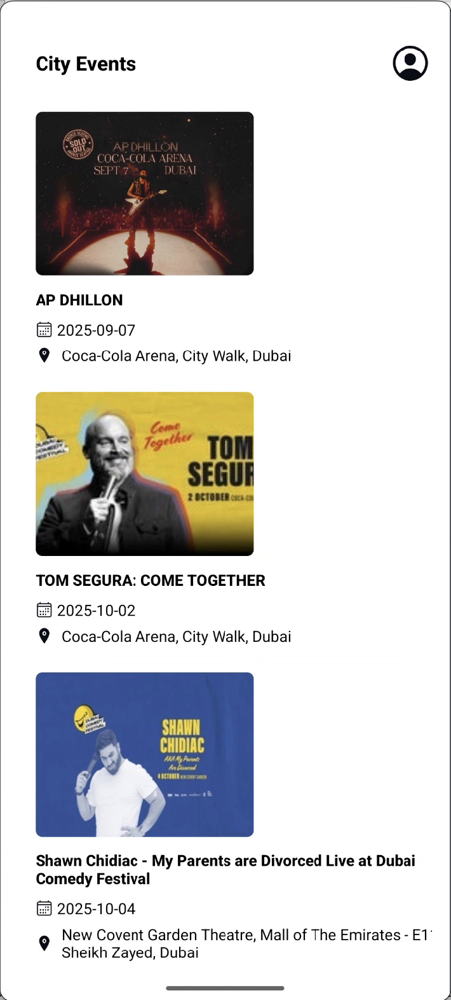
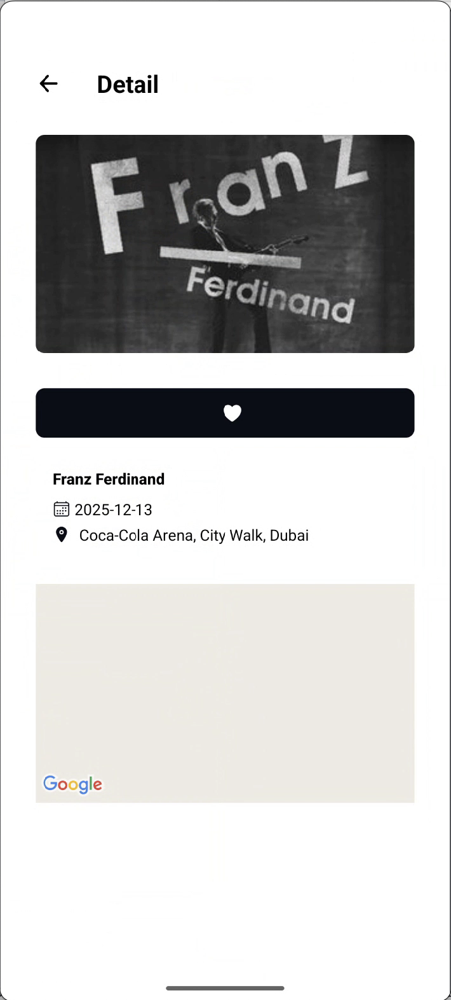
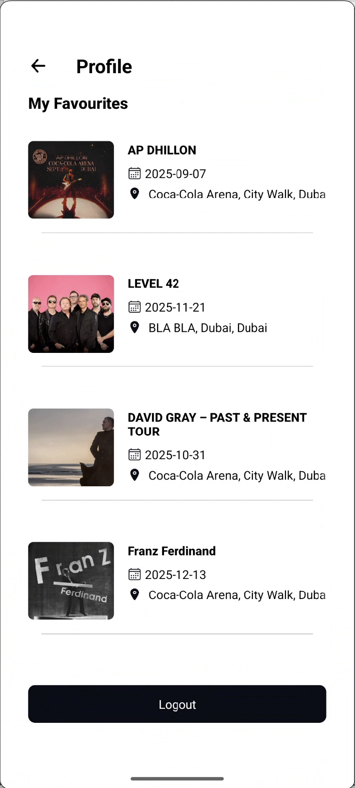

# City Events

A **City Events React Native app** with the following features:

- RTL & LTR support (Arabic/English)
- Splash screen with locale/theme initialization
- Login screen with:
  - Email/password Login
  - Biometric login (Touch ID / Face ID)
  - Signup
- Home screen:
  - API integration
  - List rendering
- Detail screen:
  - Item details
  - Favorite button (cached securely)
  - Map & location info
- Persistent state & secure storage
- Generic API client using Axios
- Locale switching with automatic reload

---

## **Screenshot**

<p>
  
  
  
  
  
  
  
  
</p>

## **Installation**

```bash
# Clone the repo
git clone https://github.com/username/MyReactNativeApp.git
cd MyReactNativeApp

# Install dependencies
npm install
# or
yarn install

# Run on android
npx expo run:android

# Run on android
npx expo run:ios
```
---

## **Features**

- RTL/LTR support
- Dark/light theme toggle
- Biometric login (Touch ID / Face ID)
- API client with Axios (supports API key & token)
- Persistent secure storage
- Generic reusable components
- Locale switching with automatic app reload
-  Map integration in detail screen

---


